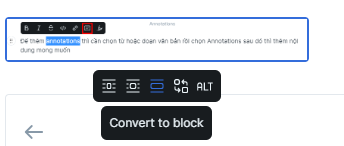

# Image

Có thể insert thêm ảnh vào bài viết bằng cách tải ảnh từ máy local hoặc từ các url khác. Sau khi insert ảnh thì sẽ hiển thị ra 3 size khác nhau để lựa chọn:

* **Inline size**
* **Original size**
* **Convert to block**

<figure><figcaption>
Chỉnh kích thước ảnh
</figcaption></figure>
